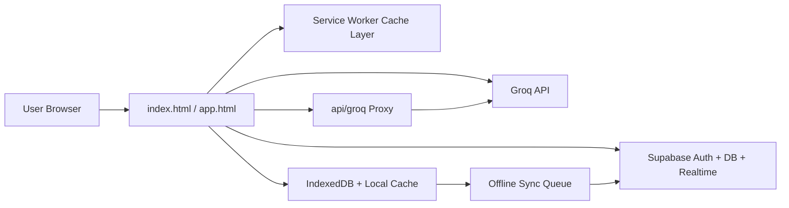

<p align="center">
    
</p>


<p align="center">
    <a href="#-live-highlights"></a>
    <a href="#-ai-capabilities"></a>
    <a href="#-tech-stack"></a>
    <a href="#-deployment--security"></a>
</p>

<h3 align="center">A polished, intelligent task command center built for speed, clarity, and reliability.</h3>

<p align="center">
TaskFlow combines clean design, robust offline behavior, realtime sync, and AI-assisted planning in a single vanilla HTML/CSS/JS app.
</p>

---

## ✨ Live Highlights

- Offline-first architecture with Service Worker app shell caching + IndexedDB persistence
- Smart sync queue with retry flow when reconnecting
- Supabase auth with offline-safe cached session and profile fallbacks
- Drag-and-drop task movement, project organization, and multi-view workflow control
- Built-in analytics dashboard, focus mode, Pomodoro timer, and reminders
- AI assistant with personal API key support and secure server proxy fallback

## 🧠 AI Capabilities

TaskFlow ships with 10 practical AI workflows:

1. Generate Tasks from a goal
2. NLP Quick Add parsing
3. Smart Priority suggestion
4. Auto-Describe task expansion
5. Daily Briefing generation
6. AI Chat over your task context
7. Due Date Suggestion
8. Mood-based Recommendations
9. Weekly Review summaries
10. Difficulty Estimation with tips

Default model: Llama 3.3 70B Versatile via Groq.

If a user has no personal key configured, TaskFlow can call a server-side proxy endpoint at api/groq using GROQ_API_KEY in Vercel environment variables.

## 🛠 Tech Stack

| Layer | Technology |
|---|---|
| Frontend | HTML5, CSS3, Vanilla JS ES6+ |
| Data + Auth | Supabase (Postgres, Auth, RLS, Realtime) |
| AI | Groq API (Llama 3.3 70B Versatile) |
| Offline | Service Worker, IndexedDB, localStorage caching |
| Deployment | Vercel (clean URLs + rewrites + redirects) |

## 🧩 Experience Surface

Views available in-app:

- Board
- List
- Grid
- Calendar
- Timeline
- Focus Mode
- Eisenhower Matrix
- Analytics

Additional productivity flow:

- Keyboard shortcuts for fast navigation
- Theme engine with 10 visual themes
- Onboarding flow for first-time users
- Notification reminders and offline status awareness
- Export tasks as JSON from settings

## 🏗 Architecture Snapshot



## 📁 Project Structure

```text
.
|-- index.html
|-- app.html
|-- emails-preview.html
|-- api/
|   `-- groq.js
|-- assets/
|   `-- supabase-sdk.js
|-- css/
|   |-- reset.css
|   |-- variables.css
|   |-- base.css
|   |-- components.css
|   |-- views.css
|   |-- animations.css
|   `-- responsive.css
|-- emails/
|   |-- email-variables.css
|   |-- confirm-signup.html
|   |-- reset-password.html
|   |-- change-email.html
|   `-- magic-link.html
|-- js/
|   |-- supabase.js
|   |-- auth.js
|   |-- db.js
|   |-- tasks.js
|   |-- projects.js
|   |-- ui.js
|   |-- ai.js
|   |-- timer.js
|   |-- notifications.js
|   |-- theme.js
|   |-- sync.js
|   |-- stats.js
|   `-- app.js
|-- sw/
|   `-- service-worker.js
|-- supabase-schema.sql
`-- vercel.json
```

## 🚀 Quick Start

### 1. Create Supabase Project

1. Create a new Supabase project.
2. Run supabase-schema.sql in SQL Editor.
3. Enable Google OAuth in Authentication > Providers.
4. Copy files from emails/ into Supabase Auth email templates.

### 2. Configure Client Keys

Update values in js/supabase.js:

```javascript
const SUPABASE_URL = 'https://your-project.supabase.co';
const SUPABASE_ANON_KEY = 'your-anon-key';
```

### 3. Configure AI Fallback Key (Optional but Recommended)

In Vercel project settings, add:

```bash
GROQ_API_KEY=your_server_side_key
```

This powers api/groq when users do not provide their own key in settings.

### 4. Deploy

```bash
npx vercel
```

## 🔐 Deployment + Security

Current deployment config includes:

- Clean URLs and route rewrites (for app and email preview)
- Security headers like X-Frame-Options, X-Content-Type-Options, Referrer-Policy
- Strong cache-control strategy for static assets and HTML revalidation

## ⌨ Keyboard Shortcuts

| Key | Action |
|---|---|
| N | New task |
| 1-4 | Switch view |
| F | Focus mode |
| S | Settings |
| A | Analytics |
| Ctrl+K | Search |
| ? | Show shortcuts |

## 📧 Email Template Studio

Open emails-preview.html and enter PIN 1234 to preview transactional templates with:

- Desktop/mobile preview
- Dark mode simulation
- Plain text version
- Raw HTML inspection
- Responsive width testing

---

<p align="center">
    <b>TaskFlow</b> • Designed for beautiful productivity under real-world network conditions.
</p>

<p align="center">
    
</p>
